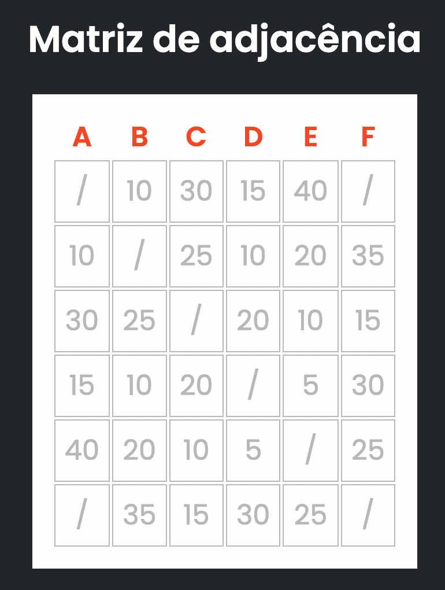

# Challenge - Calculando Distâncias no Grafo

## Qual o desafio? 🧑🏻‍💻

Uma matriz de adjacência é uma das formas de se representar um grafo. Nesse caso trabalharemos com grafos que possuem arestas valoradas, ou seja, as arestas mostram a distância entre os vértices nos grafos (Imagem 1). 
Através dos valores da matriz de adjacência fornecida (Imagem 2), **você deve calcular a menor distância entre dois vértices** solicitados pelo usuário.

EX: Menor distância entre B e C




> Considere as seguintes regras:
- Se não tiver caminho disponível, retornar "Não existem caminhos"
- Se for mesma origem e destino, retornar "0"
- Caso contrário, retornar sempre a menor distância possível
- Na matriz, onde contém o valor / significa que não há arestas ligando esses vértices

> Se tiver dúvidas 
- Veja como ficou o resultado final nos meus stories
- Me chama na DM que posso ajudar! **@kipperdev**

## Por onde começo? 💻

### Rodando a aplicação 

Para rodar a aplicação é bem fácil, basta clonar esse repositório e rodar os seguintes comandos:


````bash
npm install
npm start
````

### Onde devo codar?

- Busque pelos comentários *TODO* no código
- Mexa no arquivo `calculateDistance.ts` para realizar os cálculos de distância
- Mexa no arquivo `App.tsx`, na função `onSubmit` para ajustar parâmetros e chamadas da função

> Lembre-se! Não há apenas um jeito de resolver

## Terminei, e agora?

- Acesse a branch **feat/solution** para visualizar a minha solução caso tenha curiosidade (disponível dia 22/05 as 19h)
- Me envia a sua solução no meu instagram **@kipperdev**
  - Podemos discutir sobre as abordagens, ou até testar ambas soluções em busca de bugs ;)

#BoraCodar🚀
