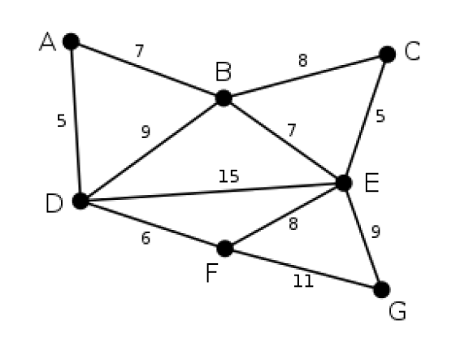

# JS Algorithm Challenge
## Qual o desafio? 🧑🏻‍💻

Baseado no [Algorítimo de Dijkstra](https://en.wikipedia.org/wiki/Dijkstra%27s_algorithm), nesse desafio **você deve calcular a menor distância entre dois vértices em um grafo** solicitados pelo usuário.

Existem dois tipos básicos de grafos, grafos não valorados onde as arestas conectam os vértices sem nenhum valor, e grafos valorados onde o valor contido nas arestas representam a distância dos vértices. Nesse caso trabalharemos com grafos que possuem arestas valoradas (Imagem 1). Uma matriz de adjacência é uma das formas de se representar um grafo, onde cada célula da matriz representa o valor da aresta que liga os dois vértices ou não (quando não há aresta conectando-os diretamente), ao iniciar essa aplicação você pode visualizar o grafo em forma de matriz.

Perceba que em um grafo pode existir *nenhum ou N caminhos diferentes que ligam um vértice a outro*, e o seu algoritmo deverá retornar para o usuário a menor distância possível entre dois vértices.

Ex: Qual menor distância entre B e C?

<p align="center"></p>


> Considere as seguintes regras:
- Se não tiver caminho disponível, retornar "Não existem caminhos"
- Se for mesma origem e destino, retornar "0"
- Caso contrário, retornar sempre a menor distância possível
- Na matriz, onde contém o valor / significa que não há arestas ligando esses vértices diretamente

> Se tiver dúvidas 
- Me chama na DM que posso ajudar! [@kipperdev](https://www.instagram.com/kipper.dev/)
- Veja meus destaques de [desafios](https://www.instagram.com/stories/highlights/17909793725446776/) no Instagram, lá expliquei como funciona certinho :)

## Por onde começo? 💻

### Rodando a aplicação 

Para rodar a aplicação é bem fácil, basta clonar esse repositório e rodar os seguintes comandos:


````bash
npm install
npm start
````

- A aplicação está rodando na porta 3000
`localhost:3000`

### Onde devo codar?

- Busque pelos comentários *TODO* no código
- Mexa no arquivo `calculateDistance.ts` para realizar os cálculos de distância
- Mexa no arquivo `App.tsx`, na função `onSubmit` para ajustar parâmetros e chamadas da função

> Lembre-se! Não há apenas um jeito de resolver

## Terminei, e agora?

- Acesse a branch **feat/solution** para visualizar a minha solução caso tenha curiosidade
- Me envia a sua solução no meu instagram  **[@kipper.dev](https://www.instagram.com/kipper.dev/)**
  - Podemos discutir sobre as abordagens, ou até testar ambas soluções em busca de bugs ;)

#BoraCodar🚀
